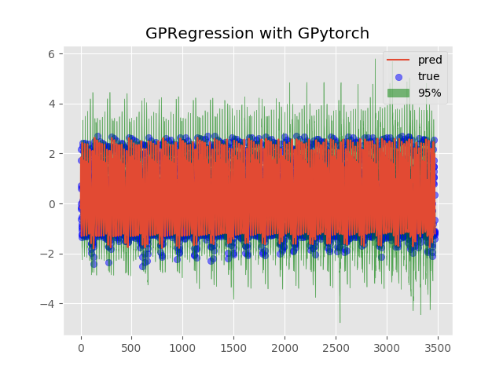

# GP Regression using a neural network to learn covariance matrix function

Deep kernels allow us to train gp regressions without specifically producing a covariance generation function.



### Dependancies
Uses Python 3.7+ and GPytorch, dependancies can be found in requirements.txt

### Quickstart
```sh
python -m pip install -U requirements.txt 
python gp_singleeval.py 
```

the hyperparameters that can be tuned and the default are:

``` py
# Where to store the results of experiment. Results are stored as pandas.DataFrame objects exported to csv.
RESULTS_ROOT_PATH = "."
# Learning rate of Kernel learning stage
LEARNING_RATE = 0.10
# Rolling integer value to normalize the time series data
ROLLING_VAL = 10
# Number of hidden layers in first layer
N1_LAYERS = 40
# Number of hidden layers in second layer
N2_LAYERS = 20
# Number of Epochs to train
N_EPOCHS = 25
# Size of Kernel embedding grid
GRID_SIZE = 100
```
``` sh
# Terminal Output
Iter 1/25 - Loss: 1.680
Iter 2/25 - Loss: 1.294
Iter 3/25 - Loss: 1.193
Iter 4/25 - Loss: 1.175
Iter 5/25 - Loss: 1.170
Iter 6/25 - Loss: 1.158
Iter 7/25 - Loss: 1.140
Iter 8/25 - Loss: 1.118
Iter 9/25 - Loss: 1.077
Iter 10/25 - Loss: 1.031
Iter 11/25 - Loss: 0.974
Iter 12/25 - Loss: 0.923
Iter 13/25 - Loss: 0.874
Iter 14/25 - Loss: 0.819
Iter 15/25 - Loss: 0.773
Iter 16/25 - Loss: 0.734
Iter 17/25 - Loss: 0.702
Iter 18/25 - Loss: 0.667
Iter 19/25 - Loss: 0.636
Iter 20/25 - Loss: 0.632
Iter 21/25 - Loss: 0.602
Iter 22/25 - Loss: 0.569
Iter 23/25 - Loss: 0.577
Iter 24/25 - Loss: 0.702
Iter 25/25 - Loss: 0.593


        y_true  predicted     lower     upper
0    -0.217715  -0.176202 -0.570978  0.218573
1    -0.138737  -0.170291 -0.569838  0.229256
2     0.590792   0.954275  0.068272  1.840279
3     2.158422   1.905800  1.435273  2.376327
4     1.716447   1.534776  1.140501  1.929051
5     0.727939   0.636680  0.278592  0.994768
6    -0.009226  -0.149619 -0.505257  0.206018
7    -0.626225  -0.508586 -0.830176 -0.186996
8    -0.981629  -0.838529 -1.278541 -0.398516
9    -1.228686  -1.116772 -1.700276 -0.533268
10   -1.341072  -1.200326 -2.664783  0.264130
11   -1.242831  -1.152914 -2.597130  0.291302
12   -1.070128  -1.074369 -2.679677  0.530939
13   -0.917122  -0.998681 -2.989485  0.992122
14   -0.829646  -0.928465 -3.001485  1.144555
15   -0.544447  -0.309998 -1.934313  1.314317
16    0.675344   1.194385 -0.383245  2.772015
17    2.438991   2.492218  0.819173  4.165263
18    2.303906   2.142715  0.621122  3.664308
19    0.606358   1.042014 -0.579233  2.663262
20    0.043022   0.004994 -1.628513  1.638500
21    0.058614   0.067702 -1.335984  1.471387
22    0.121419   0.205963 -1.352609  1.764535
23    0.142322  -0.014248 -1.566074  1.537579
24   -0.368221  -0.244776 -1.846661  1.357110
25   -0.308056  -0.223431 -1.892476  1.445614
26    0.530569   0.724630 -0.864701  2.313960
27    2.070980   1.802451  0.198636  3.406267
28    1.840039   1.481919 -0.140464  3.104303
29    0.938854   0.566939 -0.917629  2.051507
...        ...        ...       ...       ...
3444 -0.287986  -1.395663 -5.130503  2.339177
3445 -1.713781  -1.676154 -4.829354  1.477047
3446 -2.094724  -1.261439 -5.172408  2.649529
3447 -1.951655  -1.068986 -4.844508  2.706535
3448 -1.637088  -0.967314 -4.968731  3.034103
3449 -1.120683  -0.996879 -5.463542  3.469785
3450 -1.217711  -1.348202 -3.430602  0.734197
3451 -1.277038  -1.201725 -3.697945  1.294495
3452 -1.216532  -0.965056 -3.267494  1.337382
3453 -1.225409  -0.826391 -2.893103  1.240321
3454 -1.078611  -0.092401 -2.359857  2.175055
3455 -0.816665   1.540630 -0.606694  3.687954
3456  0.822292   2.662869  0.752264  4.573473
3457  2.177932   2.134865  0.215193  4.054537
3458  2.561910   0.617983 -1.393800  2.629767
3459  1.471573  -0.029810 -2.178055  2.118435
3460  0.783825  -0.003661 -2.420006  2.412684
3461  1.056317   0.220887 -2.603495  3.045269
3462  1.494023   0.032955 -3.023004  3.088915
3463  1.025166  -0.143179 -3.315428  3.029070
3464  1.301006  -0.214410 -3.610741  3.181922
3465  1.745355   0.371274 -2.969868  3.712416
3466  0.337755   1.622422 -1.992461  5.237306
3467 -0.644385   1.681871 -1.863078  5.226820
3468 -1.159209   0.779441 -2.871543  4.430425
3469 -1.082734  -0.193245 -3.865484  3.478994
3470 -1.407897  -0.609962 -4.231760  3.011836
3471 -1.189559  -0.974286 -4.599671  2.651100
3472 -1.250419  -1.266725 -4.950174  2.416725
3473 -1.127240  -1.280961 -5.627323  3.065402
```